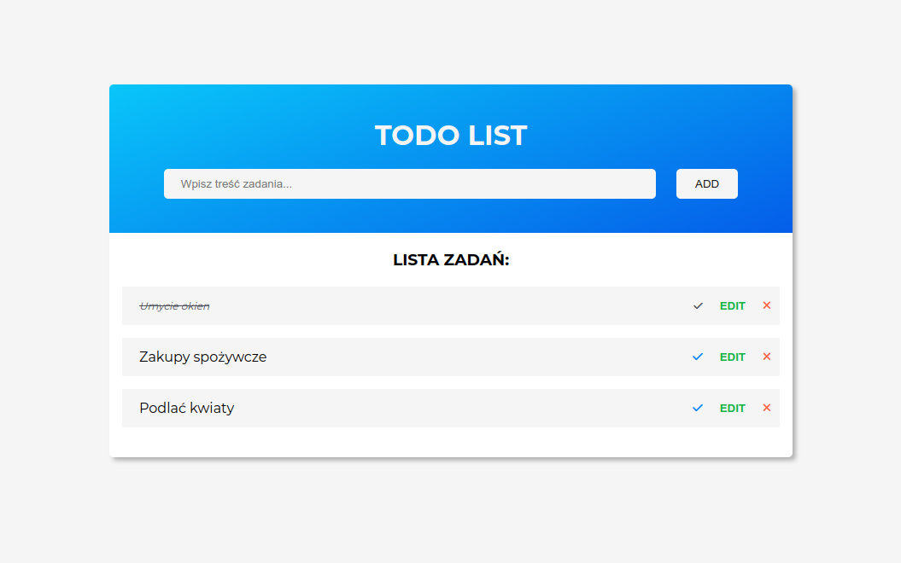
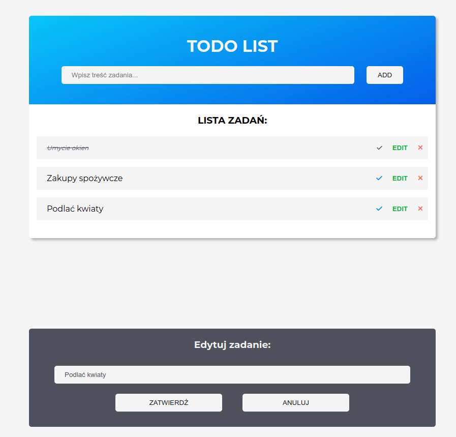
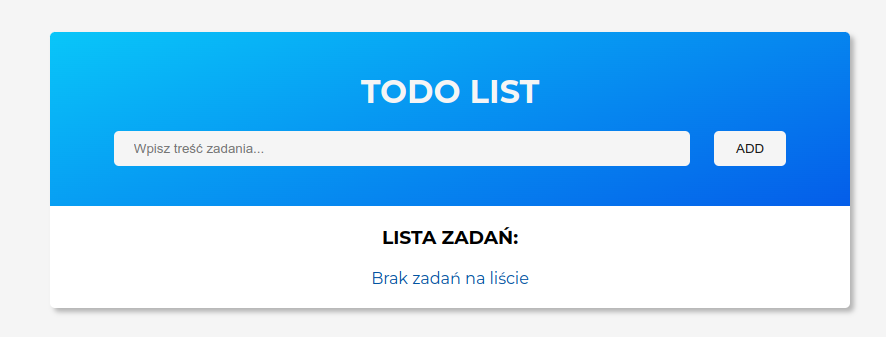

# ToDo-list

## General Information
Web app for managing chores and to-do lists. With this app, you can improve your time organization without extra sheets of paper. 

## Technologies
Project is created with:
* HTML
* CSS
* JavaScript

## Features
- possibility to add your personalized tasks,
- deferring tasks, without removing it from the list,
- security to add empty tables to the To Do list,
-  the ability to edit at any time.


## Code fragment
The following code presents the moment when we have completed all the tasks in the list and deleted them. The To Do list then presents the note "No tasks on the list".
```
const deleteTask = (e) => {
	e.target.closest('li').remove();

	const allTask = ulList.querySelectorAll('li');

	if (allTask.length === 0) {
		errorInfo.textContent = 'Brak zadań na liście';
	} else {
		errorInfo.textContent = '';
	}
};
```


## Acknowledgements
The design of the website was created while learning the JavaScript course from MMC School (https://mmcschool.pl/kursy/kurs-javascript.html)

## Contact
Feel free to contact me:
<br> 
Email: aleksandrawypych.p@gmail.com <br>
Portfolio: https://www.behance.net/aleksanwypych-p
